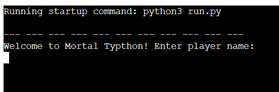
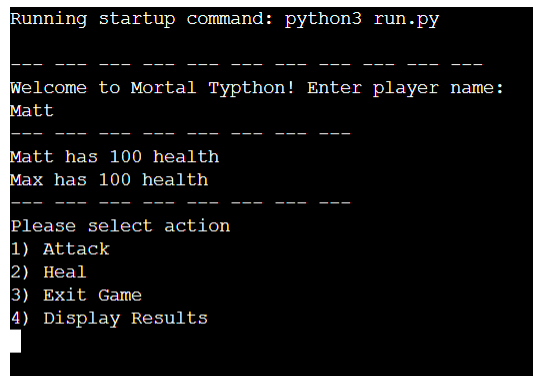
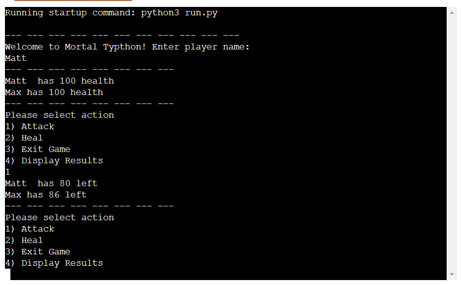
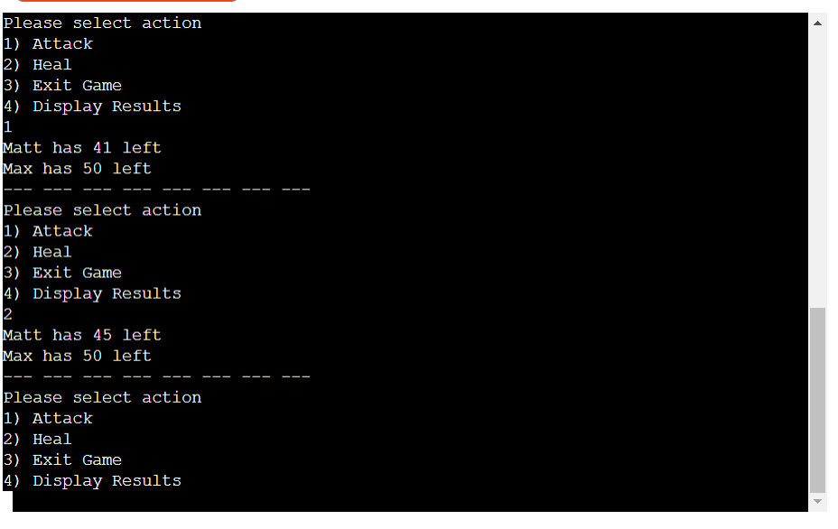
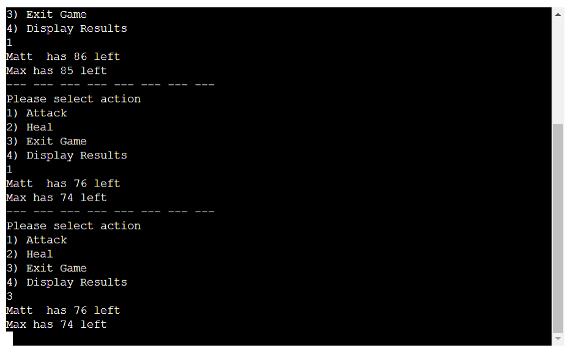
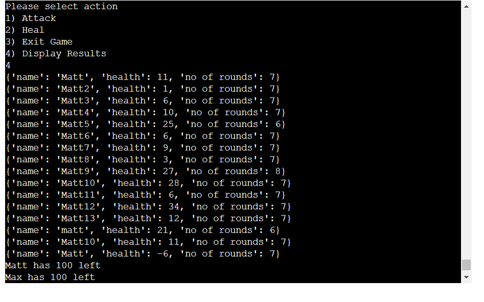
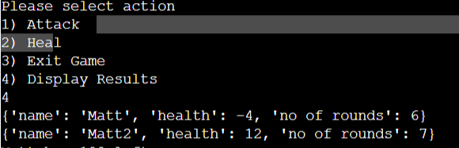
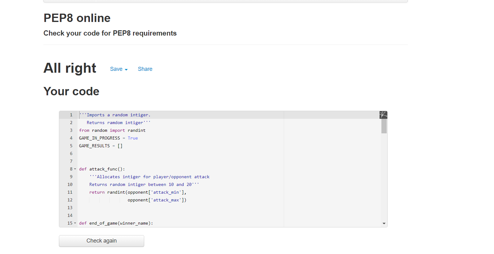

# Mortal Typthon

[Live site can be found here](#)

Mortal Typthon is a text based battle game written in Python. The basic idea of the game is for you, the player, to beat your AI opponent (called Max), by attacking or healing as needed. Which player wins or looses is determined by which players health reaches 0 or below first. The game will continue to play in a loop until the player quits.

## Features
On starting the game, the player is greeted with a welcome message, as well as a prompt to enter their name as illustrated below:

Welcome Screen:

Once the user enters their name, the player and opponents health are shown, as well as the options of: 1 "attack", 2 "heal", 3 "exit game" and 4 "display results" as per illustration below:

Options Screen:

The player must then select options 1-4 by typing in the relevent number.

1) Attack:
This will decrease both player and opponent health by a random number between 10 and 20 as shown below:

2) Heal:
This will increase the player's health by a maximum of 16, although, the opponent's attack may also lessen or even wipe out the amount of health the player is given when healing as per below:

3) Exit Game:
This option speaks for itself and will exit the player out of the game completely, while displaying current player and opponent health as per below:

4) Display results:
This displays previous game results in the current seission by displaying player name, player health when finishing and the number of rounds taken to finish, as demonstrated below:

### Technologies Used:
- Python

- Gitpod and Microsoft Visual Studio Code (to build project)

- Horku and Github (for deployment)

### Existing Features

- Round counter: When the player selects the option to display results, they are also presented with the 'no of rounds' that it took for the player to complete the game, weather they win or loose, as illustrated below:

 ### Features Left to Implement

 - Would like to add a number beside each list item which increases according to the number of items on the list, as well as the already included counter at the top of the list.
 - Would like to improve app layout on smaller screens in future to reduce the need for the user to scroll.
 - Favicon nto displaying properly on live site so had to remove for now as also causing console errors.

## Testing

- I have run the game through gitpod, visual studio code and horuku with no errors.
- Gitpod was showing problems due to missing docstrings in code, which I have no rectified.
- I have played through multiple rounds of the game and it contines to loop without error, however, the game logic does seem a bit bias towards the player, giving them an advantage.
- This could perhaps be rectified by changing the random numbers range within the dictionary for player, opponent or both.
- Decorative strings seperating different portions of the game do not match up to the relevent text, so will rectify this before final deployment.

### Validator Testing
- All code passed through PEP8 validator with no issues as per below:

## Deployment

Setting up a new repository on Github:
1. Log into Github.
2. In my case, I wanted to build the repository using the one of code institute's templates.
3. Within the relevent repository I selected "use this template".
4. Git hub then created the new repository, which could later be linked into Heroku for deployment.

The app was deployed to Heroku via Github. The steps to deploy are as follows:

1. Log into Horku and select "new" and then select "Create new app".
2. Select an app name and region and select "create app".
3. Select your newly created app from your dashboard and click the settings tab.
4. Add any config Vars or build packs needed for app, in this case, PORT 8000 config vars and Python and nodejs for  build packs, remembering to ensure Python is your first build pack.
5. Click the "Deploy" tab and under "Deployment Method" select "Github Pages".
6. Log into Github and select correct repository to connect to app.
7. For convenience, I selected "Automatic Deploys" so the app is updated automatically after each push from Gitpod/Visual Studio code.

Making a local clone:

1. Login to gitbub and download github desktop.
2. Select the correct repository from the dropdown list in the top left.
3. Secect the 'repository' menu and from it select 'pull'.
4. Select 'open in visual studio code' from the home screen.
5. The repository can now be worked on locally, without the need to gitpod etc.

Forking the repository:

1. Login to Gitbut and select the relevent repository.
2. At the top the the repository (not page), select settings.
3. Then select fork. I am currently not able to fork the repository as I own it, but this this the procedure one would normally follow.

## Credits

- Youtube tutorials used to help build app:

https://www.youtube.com/watch?v=kDdTgxv2Vv0

Channel Link:https:https://www.youtube.com/c/Academind (Academind)

- I really enjoyed building this project with the help of this totorial, as it showed a very real life example of how Python can be used and implemented. Going though basics such as variables, disctionaries, lists, functions, loops etc. Tis really helped solidify all the material form the Python essentials module, as well as being able to compare to other comparative programing languages.

- Code institute Python essentials mocule.

- This gave me the basic theory and exercises and helped me to understand logically, what each line of code was doing.

- https://www.geeksforgeeks.org/

- Found this site extremely using for issues such as correct incdentation (which I really struggled with) as well as writing proper comments and docstrings when coding.

### Content

- Basic game content idea was gotten from previously mentioned tutlrial, as well as the project 3 breif within the code institute LMS.

### Acknowledgements

- My mentor for all his help and advise.
- The tutors at code institue for their helpful assistance.
- The youtubers whose tutorials helped further develop my coding skills.

